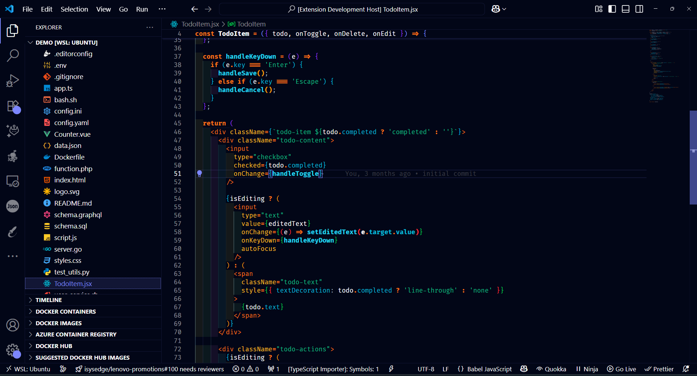
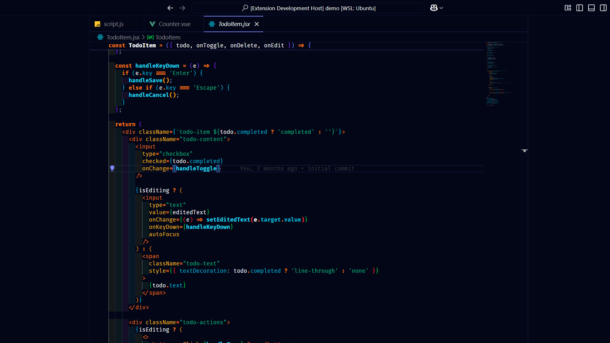
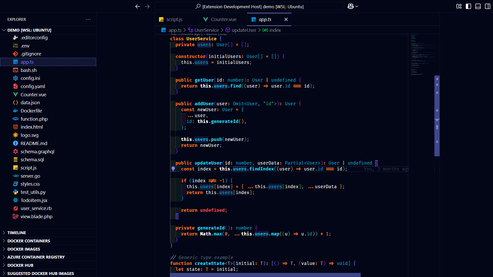
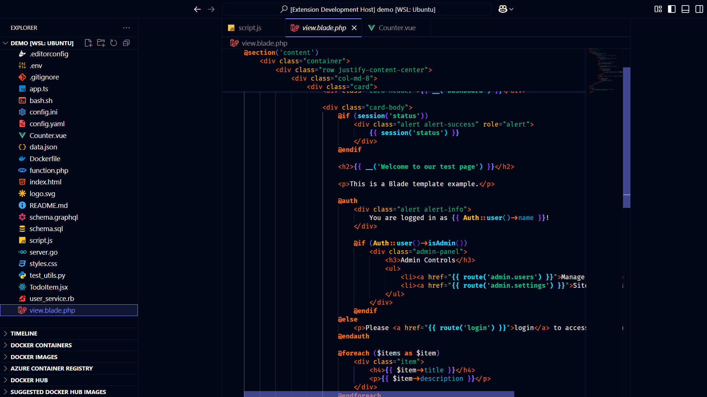
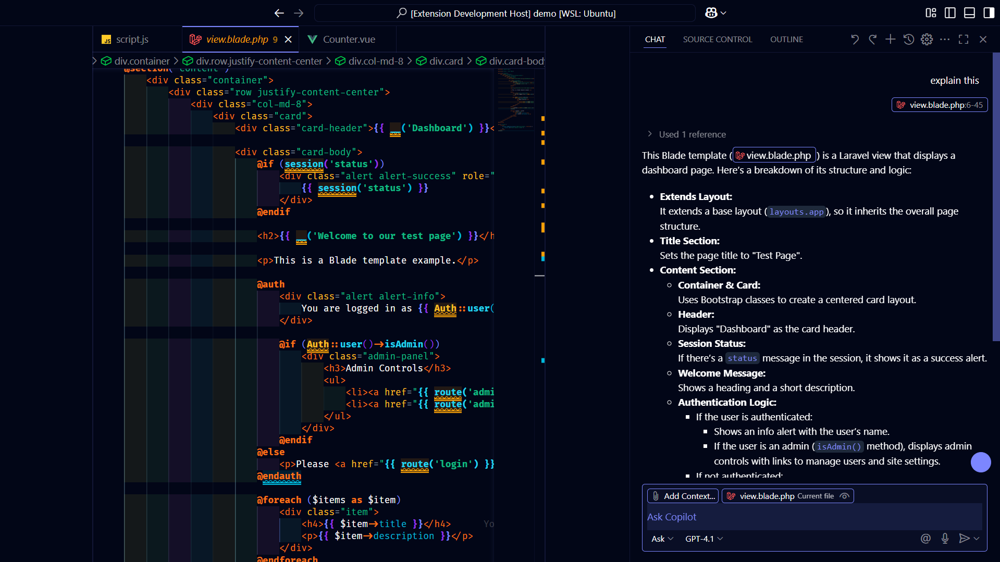

# Fexend Theme

A dark, vibrant Visual Studio Code theme inspired by Tailwind CSS and the Shades of Purple theme.

## Features

- **Dark mode** with carefully selected color palette
- **Italic and bold syntax highlighting** for improved code readability
- **Consistent colors** across UI elements and code tokens
- **Inspired by Tailwind CSS** and Fexend's own design language

## Installation

1. Open VS Code
2. Go to Extensions (Ctrl+Shift+X)
3. Search for "Fexend Theme"
4. Click Install
5. Go to File > Preferences > Color Theme
6. Select "Fexend Dark"

## Screenshots

## Credits

- Colors inspired by [Tailwind CSS](https://tailwindcss.com/)
- Theme structure inspired by [Shades of Purple](https://github.com/ahmadawais/shades-of-purple-vscode)
