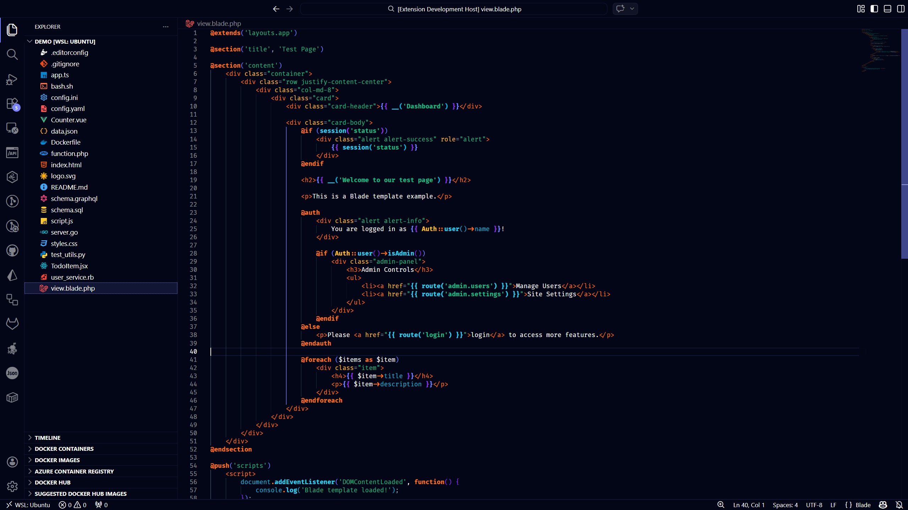
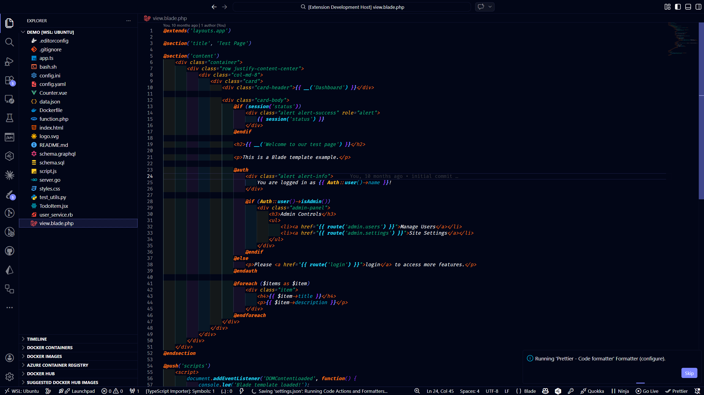
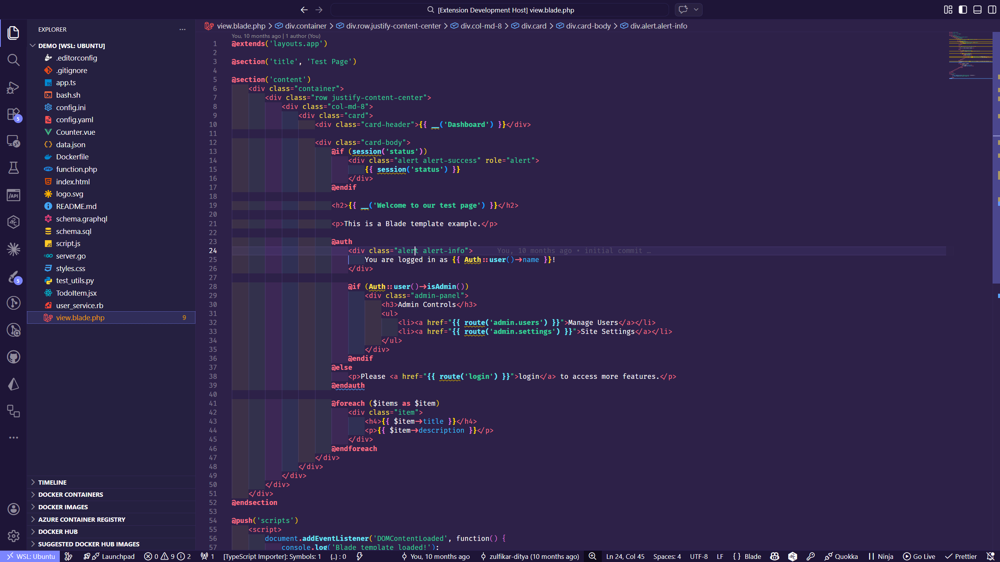
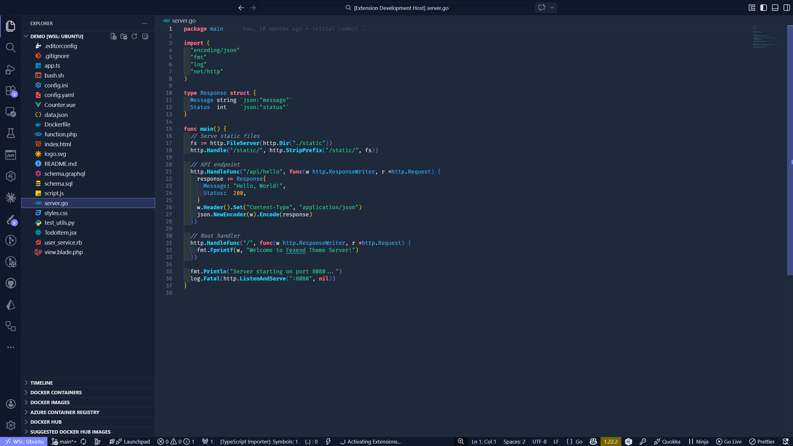

# Fexend Theme

A dark, vibrant Visual Studio Code theme inspired by Tailwind CSS and the Shades of Purple theme.

## Theme Variants

### Fexend Theme (Default)

A bold, vibrant dark theme with Tailwind-inspired colors.

### Fexend Theme Italic

Same as the default, with italic styling for keywords and type annotations.

### Fexend Theme Medium Purple

A purple-accented variant with a rich, deep look.

### Fexend Theme Soft Dark

A softer, easier-on-the-eyes dark theme with slate backgrounds.

## Features

- **4 theme variants** — Default, Italic, Medium Purple, and Soft Dark
- **Dark mode** with carefully selected color palette
- **Italic and bold syntax highlighting** for improved code readability
- **Consistent colors** across UI elements and code tokens
- **Inspired by Tailwind CSS** and Fexend's own design language
- **Markdown syntax highlighting** support

## Installation

1. Open VS Code
2. Go to Extensions (`Ctrl+Shift+X`)
3. Search for **Fexend Theme**
4. Click Install
5. Go to `File > Preferences > Color Theme`
6. Select your preferred variant:
   - `Fexend Theme`
   - `Fexend Theme Italic`
   - `Fexend Theme Medium Purple`
   - `Fexend Theme Soft Dark`

## Credits

- Colors inspired by [Tailwind CSS](https://tailwindcss.com/)
- Theme structure inspired by [Shades of Purple](https://github.com/ahmadawais/shades-of-purple-vscode)
